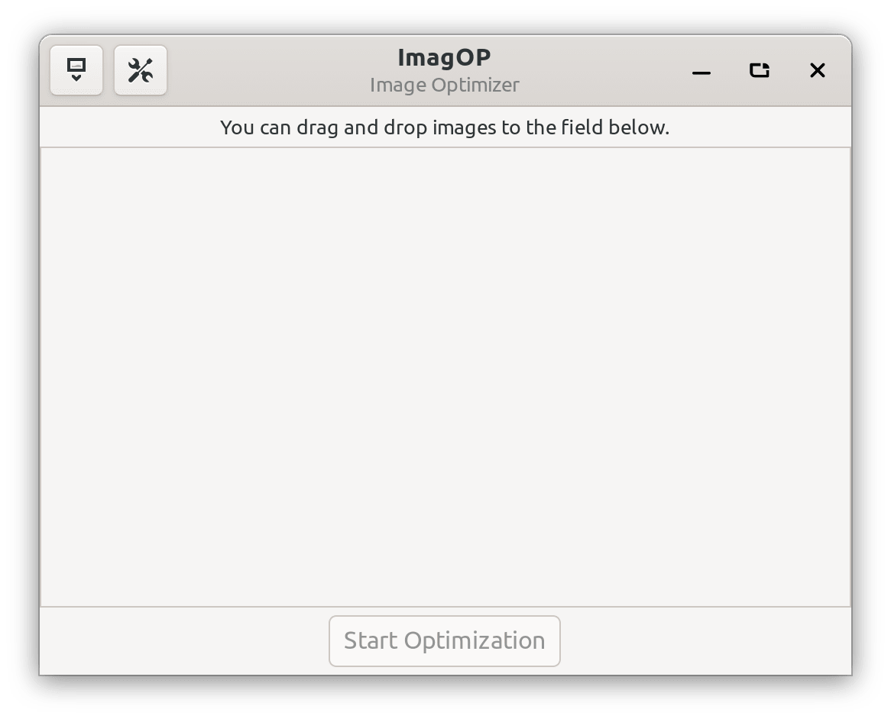
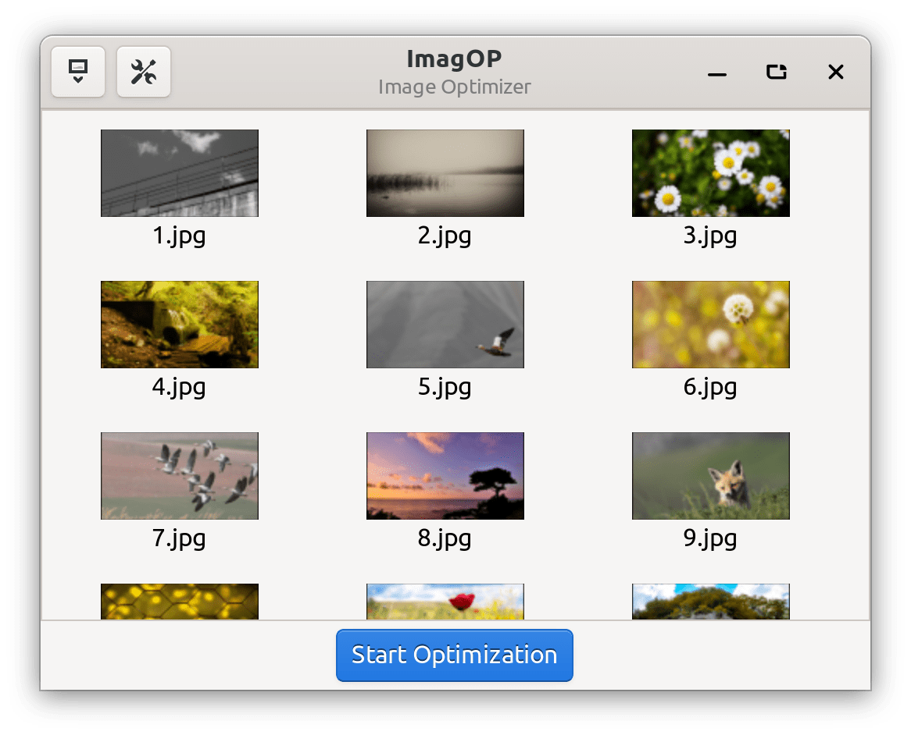
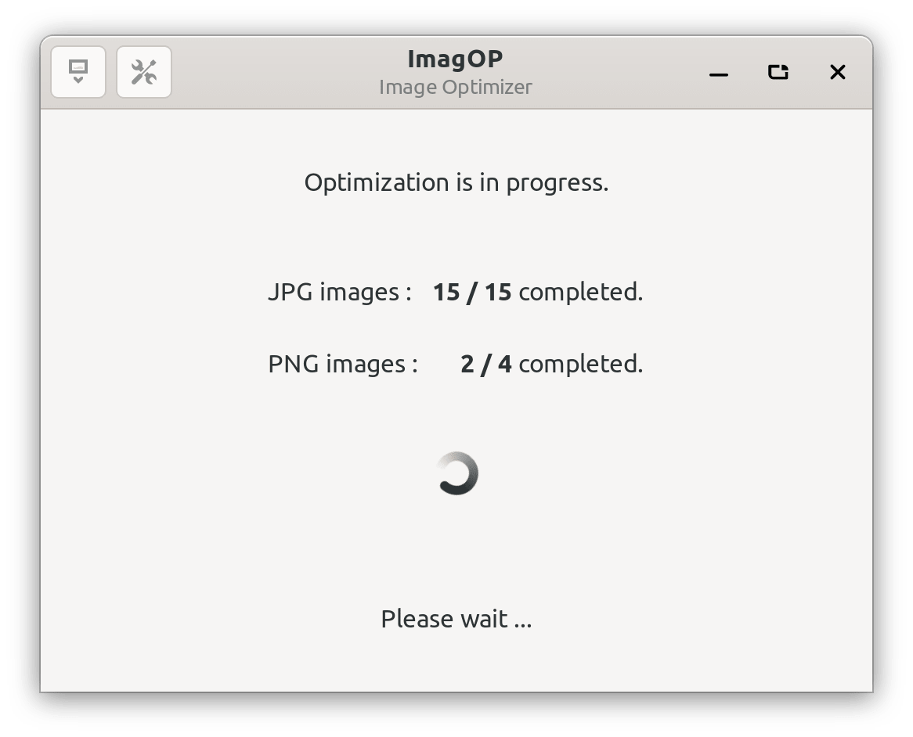
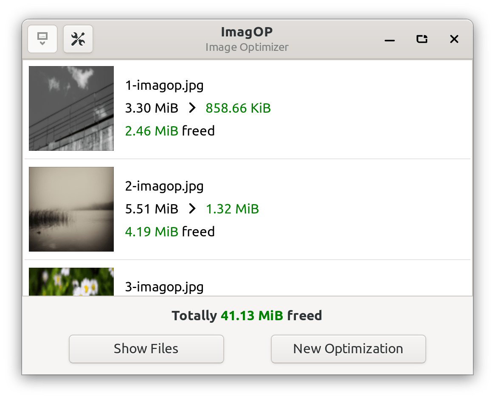
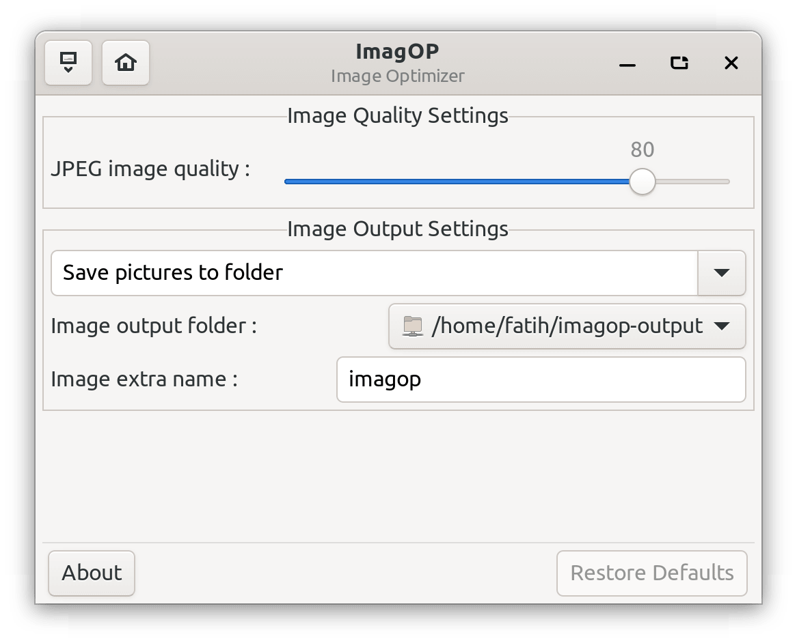

# ImagOP

ImagOP (image optimizer) is an application for lossy image file optimization.

Currently only png and jpg images are supported.
It uses pngquant and zopfli to optimize png images, python3-pil to optimize jpg images. 

You can add images to the application interface by drag and dropping them.
You can remove the pictures from the list in the interface by right-click  or double-clicking them.

You can set your picture output preferences and quality from the settings.

### **Dependencies**

This application is developed based on Python3 and GTK+ 3. Dependencies:
```bash
gir1.2-glib-2.0 gir1.2-gtk-3.0 gir1.2-notify-0.7 python3-pil pngquant zopfli
```

### **Run Application from Source**

Install dependencies
```bash
gir1.2-glib-2.0 gir1.2-gtk-3.0 gir1.2-notify-0.7 python3-pil pngquant zopfli
```

Clone the repository
```bash
git clone https://github.com/maunalinux/imagop.git ~/imagop
```

Run application
```bash
python3 ~/imagop/src/Main.py
```

### **Build deb package**

```bash
sudo apt install devscripts git-buildpackage
sudo mk-build-deps -ir
gbp buildpackage --git-export-dir=/tmp/build/imagop -us -uc
```

### **Samples**

> #### Original (png) (2.8 MiB)
>
> 

> #### Optimized (png) (835.1 KiB)
>
> 
---

> #### Original (jpg) (2.5 MiB)
>
> 

> #### Optimized (jpg) (1.2 MiB)
>
> 

### **Screenshots**










